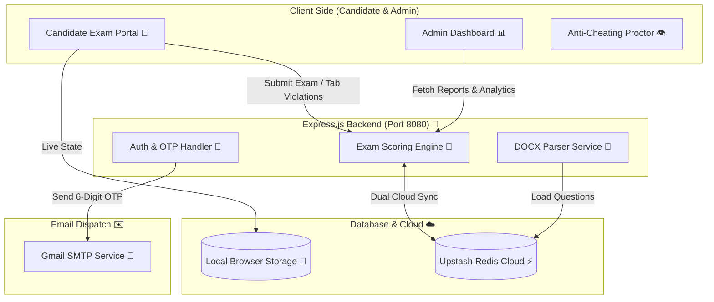

<div align="center">

  <h1>⚡ YOKOHAMA ILUO PORTAL | NO CAP CERTIFICATION SYSTEM 💅</h1>

  <p>
    <strong>The Most Aesthetic, Anti-Cheating, Auto-Excel Generating QA Exam Platform. Fr Fr. 🗣️🔥</strong><br>
    <em>Engineered for Yokohama Off-Highway Tires (OHT) Quality Assurance Legends.</em>
  </p>

  <p>
    <a href="https://nodejs.org"></a>
    <a href="https://expressjs.com"></a>
    <a href="https://upstash.com"></a>
    <a href="https://vercel.com"></a>
    <a href="https://developer.mozilla.org/en-US/docs/Web/JavaScript"></a>
  </p>

  <br />
</div>

---

## 🍵 What's the Tea? (Executive Summary)

The **Yokohama ILUO Skill Assessment Portal** is an absolute game-changer. We took legacy paper tests, threw them out the window, and built a lightning-fast, proctored, anti-cheating digital assessment hub that automatically turns candidate answers into formatted **Excel reports (`.xlsx`)**.

> [!IMPORTANT]
> - 🧠 **712+ Verified MCQs**: Pre-loaded directly from 24 official Yokohama QA `.docx` files. Zero fake questions.
> - 🗿 **Zero Malpractice**: Built-in tab-switch detector that terminates exams on the 3rd strike.
> - 📊 **Instant Excel Export**: Audit-ready spreadsheet downloads with one click. Period.

---

## 🚀 Features That Go Hard

### 🎯 1. ILUO Skill Levels (Main Character Progression)
- 🟢 **I Level (Trainee Era)**: Basic onboarding & safety vibe checks.
- 🟡 **L Level (Basic Skill)**: 20 Questions – Process & quality verification.
- 🟠 **U Level (Skilled Operator)**: 30 Questions – Independent operational mastery.
- 🔴 **O Level (God Tier Expert)**: 40 Questions – Master auditor & defect specialist standard.
- ⚖️ **Balanced Category Engine**: Automatically balances questions proportionally across **Safety & Environment**, **CI & TPM**, and **QA Technical**.
- 🔒 **Section Isolation**: Questions mapped strictly to candidate sections:  
  `Final Finish QA` | `Tire Building QA` | `Tire Curing QA` | `Preparatory QA` | `Solid Tire QA` | `Warehouse QA` | `FID Inspector QA` | `Final Finish RRO & ALT QA`

### 🛡️ 2. Tab-Switch Anti-Cheating System (3 Strikes & You're Out 🚨)
- 👁️ **Real-Time Focus Monitor**: Tracks window blurs, tab switching, or external screen jumps.
- ⚠️ **Progressive Security Alerts**: Warning modals pop up on Warning 1 & 2.
- 🛑 **Automated Auto-Termination**: 3rd tab switch instantly locks answers and sets candidate status to `Terminated (Tab Switch Violations)`. No cap.

### 📁 3. Bulk Word (.docx) Importer (Work Smarter, Not Harder 🧠)
- 📦 **Drag-and-Drop Parsing**: Upload official Word `.docx` assessment files directly in browser.
- ⚡ **Auto-Extraction**: Automatically extracts question titles, options (A, B, C, D), section headers, and category tags.

### 📊 4. Real-Time Admin Dashboard (Data Visualization Flex 📈)
- 📉 **Live Metric Cards**: Track active candidates, overall pass rate %, average score, and security flags.
- 🎨 **Chart.js Analytics**: Visual histograms for score distribution and department compliance.
- 🔍 **Instant Search**: Search employee attempt records by Employee ID, Name, or Department.

### 📥 5. Single-Click Excel Report Export 🪄
- 📄 **Audit-Ready Spreadsheets**: Download formatted `.xlsx` files complete with Employee Name, ID, DOJ, Skill Level, Section, Marks, Percentage, Tab Switch Violations, and Timestamps.

### ✉️ 6. Gmail SMTP OTP (Lock & Key Security 🔐)
- 🔑 **6-Digit One-Time Password**: Secure email OTP delivered via Gmail STARTTLS for admin actions.

### ⚡ 7. Dual-Sync Cloud Database (Zero Lag Vibe ☁️)
- ⚡ **Offline-First Speed**: Zero-lag local storage for smooth exam taking.
- ☁️ **Upstash Cloud Redis**: Permanent cloud sync keeping candidate attempts and custom questions synced everywhere.

---

## 🏗️ Architecture (How It Actually Works Fr)



---

## 🛠️ The Flex Tech Stack (No Mid Frameworks Here)

| Layer | Component | Vibe Check |
| :--- | :--- | :--- |
| **Frontend** | HTML5 + Modern Vanilla JS | Ultra fast, zero bloated bundle size |
| **Styling** | Custom CSS3 (Glassmorphism) | Dark corporate theme with main character aesthetic |
| **Charts** | [Chart.js](https://www.chartjs.org/) | Clean visual analytics & score distribution graphs |
| **Excel Export** | [SheetJS (XLSX)](https://sheetjs.com/) | Instant `.xlsx` spreadsheet generator |
| **Docx Parser** | [Mammoth.js](https://github.com/margvb/mammoth.js) | Native Word document parsing in-browser |
| **Backend** | Express.js 5.x (Node.js) | High-performance RESTful API |
| **Email OTP** | Nodemailer (Gmail SMTP) | 6-digit admin authentication codes |
| **Database** | Upstash Redis Cloud | Serverless key-value cloud database |

---

## 📂 File Directory (The Blueprint 🗺️)

```ascii
ILUO MCQ TO Excel sheet/
├── index.html                   # Single-Page Application (SPA) Master Layout
├── app.js                       # Core Portal Router, Exam Logic & Proctoring
├── data.js                      # 236 Employee Master Directory & Question Dataset
├── server.js                    # Express Server, Gmail SMTP OTP & Cloud Sync
├── styles.css                   # Premium Glassmorphism Styling
├── ILUO SKILL.xlsx              # Official Master Employee ILUO Matrix Spreadsheet
├── package.json                 # Node.js Dependencies & Scripts
├── vercel.json                  # Production Vercel Serverless Configuration
├── .env                         # Environment Variables Configuration
├── parse_true_qc_master.py      # Python Parser for Official 24 Docx Papers
├── parsed_true_qc_master.json   # Parsed Master Question Dataset
└── QC question/                 # Archive of 24 Official Word (.docx) Papers
```

---

## ⚡ Quick Start (Get It Running in 30 Seconds)

### 1. Clone & Install
```bash
git clone https://github.com/ReubenGeoffrey/yokohama-iluo-portal.git
cd yokohama-iluo-portal
npm install
```

### 2. Configure Environment (`.env`)
```env
PORT=8080
SESSION_SECRET=yokohama_iluo_qa_secret_2026
ADMIN_EMAIL=admin@company.com

SMTP_HOST=smtp.gmail.com
SMTP_PORT=587
SMTP_USER=your_email@gmail.com
SMTP_PASS=your_app_password

UPSTASH_REDIS_REST_URL=https://your-redis-instance.upstash.io
UPSTASH_REDIS_REST_TOKEN=your_upstash_rest_token
```

### 3. Launch Server
```bash
npm start
```
Go to **`http://localhost:8080`** and enjoy the vibe! 🚀

---

## 📄 License & Ownership

Copyright © 2026 **Yokohama Off-Highway Tires (OHT)** / **Reuben Geoffrey**.  
*All Rights Reserved. Enterprise Grade Proprietary Code.*
